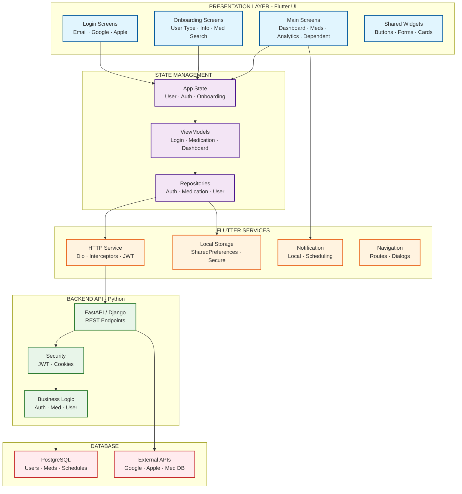
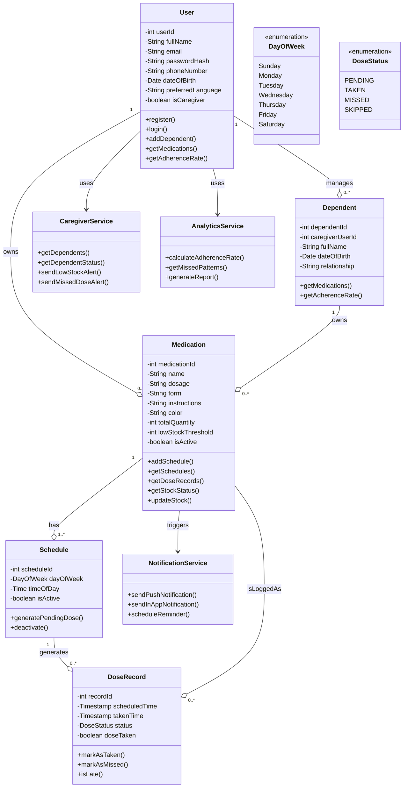

and this is the System Architecture Diagram

```mermaid
graph TD
    subgraph Layer1["PRESENTATION LAYER - Flutter UI"]
        direction LR
        P1["Login Screens<br/>Email · Google · Apple"]
        P2["Onboarding Screens<br/>User Type · Info · Med Search"]
        P3["Main Screens<br/>Dashboard · Meds · Analytics . Dependent"]
        P4["Shared Widgets<br/>Buttons · Forms · Cards"]
    end

    subgraph Layer2["STATE MANAGEMENT"]
        direction LR
        S1["App State<br/>User · Auth · Onboarding"]
        S2["ViewModels<br/>Login · Medication · Dashboard"]
        S3["Repositories<br/>Auth · Medication · User"]
    end

    subgraph Layer3["FLUTTER SERVICES"]
        direction LR
        F1["HTTP Service<br/>Dio · Interceptors · JWT"]
        F2["Local Storage<br/>SharedPreferences · Secure"]
        F3["Notification<br/>Local · Scheduling"]
        F4["Navigation<br/>Routes · Dialogs"]
    end

    subgraph Layer4["BACKEND API - Python"]
        direction LR
        B1["FastAPI / Django<br/>REST Endpoints"]
        B2["Security<br/>JWT · Cookies"]
        B3["Business Logic<br/>Auth · Med · User"]
    end

    subgraph Layer5["DATABASE"]
        direction LR
        D1["PostgreSQL<br/>Users · Meds · Schedules"]
        D2["External APIs<br/>Google · Apple · Med DB"]
    end

    P1 --> S1
    P2 --> S1
    P3 --> S1
    S1 --> S2
    S2 --> S3
    S3 --> F1
    S3 --> F2
    P3 --> F3
    F1 --> B1
    B1 --> B2
    B2 --> B3
    B3 --> D1
    B1 --> D2

    classDef layer1 fill:#e1f5fe,stroke:#01579b,stroke-width:2px
    classDef layer2 fill:#f3e5f5,stroke:#4a148c,stroke-width:2px
    classDef layer3 fill:#fff3e0,stroke:#e65100,stroke-width:2px
    classDef layer4 fill:#e8f5e9,stroke:#2e7d32,stroke-width:2px
    classDef layer5 fill:#ffebee,stroke:#c62828,stroke-width:2px

    class P1,P2,P3,P4 layer1
    class S1,S2,S3 layer2
    class F1,F2,F3,F4 layer3
    class B1,B2,B3 layer4
    class D1,D2 layer5
```

this is the class diagram 

```mermaid
classDiagram
    class User {
        -int userId
        -String fullName
        -String email
        -String passwordHash
        -String phoneNumber
        -Date dateOfBirth
        -String preferredLanguage
        -boolean isCaregiver
        +register()
        +login()
        +addDependent()
        +getMedications()
        +getAdherenceRate()
    }

    class Dependent {
        -int dependentId
        -int caregiverUserId
        -String fullName
        -Date dateOfBirth
        -String relationship
        +getMedications()
        +getAdherenceRate()
    }

    class Medication {
        -int medicationId
        -String name
        -String dosage
        -String form
        -String instructions
        -String color
        -int totalQuantity
        -int lowStockThreshold
        -boolean isActive
        +addSchedule()
        +getSchedules()
        +getDoseRecords()
        +getStockStatus()
        +updateStock()
    }

    class Schedule {
        -int scheduleId
        -DayOfWeek dayOfWeek
        -Time timeOfDay
        -boolean isActive
        +generatePendingDose()
        +deactivate()
    }

    class DoseRecord {
        -int recordId
        -Timestamp scheduledTime
        -Timestamp takenTime
        -DoseStatus status
        -boolean doseTaken
        +markAsTaken()
        +markAsMissed()
        +isLate()
    }

    class CaregiverService {
        +getDependents()
        +getDependentStatus()
        +sendLowStockAlert()
        +sendMissedDoseAlert()
    }

    class NotificationService {
        +sendPushNotification()
        +sendInAppNotification()
        +scheduleReminder()
    }

    class AnalyticsService {
        +calculateAdherenceRate()
        +getMissedPatterns()
        +generateReport()
    }

    class DayOfWeek {
        <<enumeration>>
        Sunday
        Monday
        Tuesday
        Wednesday
        Thursday
        Friday
        Saturday
    }

    class DoseStatus {
        <<enumeration>>
        PENDING
        TAKEN
        MISSED
        SKIPPED
    }

    User "1" --o "0..*" Dependent : manages
    User "1" --o "0..*" Medication : owns
    Dependent "1" --o "0..*" Medication : owns
    Medication "1" --o "1..*" Schedule : has
    Schedule "1" --o "0..*" DoseRecord : generates
    Medication "1" --o "0..*" DoseRecord : isLoggedAs
    User --> CaregiverService : uses
    User --> AnalyticsService : uses
    Medication --> NotificationService : triggers
```

```mermaid
classDiagram
    class User {
        -UUID id
        -String email
        -String? password_hash
        -String? google_id
        -String? apple_id
        -UserType user_type
        -String full_name
        -int age
        -Sex sex
        -String? medical_condition
        -bool is_onboarding_complete
        -bool is_active
        -DateTime last_login
        -DateTime created_at
        -DateTime updated_at
        +authenticate_email(email, password) User
        +authenticate_google(token) User
        +authenticate_apple(token) User
        +generate_jwt() String
        +verify_jwt(token) Dict
        +update_profile(data) User
        +complete_onboarding() bool
        +get_notification_preferences() NotificationPreference
        +get_medications() List~UserMedication~
        +get_dependents() List~Dependent~
        +get_adherence_rate(start_date, end_date) float
        +deactivate_account() bool
        +to_dict() Dict
    }

    class UserType {
        <<enumeration>>
        ELDERLY
        GENERAL_USER
        +display_names() Dict
        +from_string(value) UserType
    }

    class AuthResponse {
        -User user
        -String token
        -String refresh_token
        -DateTime expires_at
        -bool is_new_user
        -bool user_type_required
        -bool onboarding_complete
        +to_dict() Dict
        +to_cookie_data() Dict
        +from_dict(data) AuthResponse
    }

    class AuthService {
        +login(email, password) AuthResponse
        +login_with_google(token) AuthResponse
        +login_with_apple(token) AuthResponse
        +register_user(data) User
        +refresh_token(refresh_token) AuthResponse
        +logout(user_id) bool
        +validate_jwt(token) bool
        +get_current_user(token) User
        +reset_password(email) bool
    }

    class Medication {
        -UUID id
        -String name
        -String generic_name
        -String dosage
        -MedicationForm form
        -String? manufacturer
        -String? image_url
        -String? description
        -List~String~ side_effects
        -List~String~ warnings
        -bool is_prescription_required
        -DateTime created_at
        -DateTime updated_at
        +search(query) List~Medication~
        +get_by_id(id) Medication
        +get_by_name(name) List~Medication~
        +get_by_generic_name(generic_name) List~Medication~
        +get_interactions(medication_ids) List~MedicationInteraction~
        +to_dict() Dict
        +from_dict(data) Medication
    }

    class MedicationForm {
        <<enumeration>>
        TABLET
        CAPSULE
        LIQUID
        INJECTION
        CREAM
        INHALER
        OTHER
        +display_names() Dict
        +from_string(value) MedicationForm
    }

    class UserMedication {
        -UUID id
        -UUID user_id
        -UUID medication_id
        -UUID? dependent_id
        -String dosage
        -String frequency
        -String? notes
        -bool is_active
        -DateTime start_date
        -DateTime? end_date
        -DateTime created_at
        -DateTime updated_at
        +create(user_id, medication_id, dosage, frequency) UserMedication
        +update(data) UserMedication
        +deactivate() bool
        +add_schedule(schedule) Schedule
        +get_schedules() List~Schedule~
        +get_dose_records(start_date, end_date) List~DoseRecord~
        +get_adherence_rate() float
        +get_next_dose() DoseRecord
        +check_stock() StockStatus
        +to_dict() Dict
        +from_dict(data) UserMedication
    }

    class Schedule {
        -UUID id
        -UUID user_medication_id
        -List~DayOfWeek~ days_of_week
        -Time time_of_day
        -String? notes
        -bool is_active
        -DateTime created_at
        -DateTime updated_at
        +create(user_medication_id, days, time) Schedule
        +update(data) Schedule
        +deactivate() bool
        +activate() bool
        +generate_next_doses(days_ahead) List~DoseRecord~
        +get_next_occurrence() DateTime
        +is_due_now() bool
        +to_dict() Dict
        +from_dict(data) Schedule
    }

    class DayOfWeek {
        <<enumeration>>
        SUNDAY
        MONDAY
        TUESDAY
        WEDNESDAY
        THURSDAY
        FRIDAY
        SATURDAY
        +order() List
        +arabic_names() Dict
        +short_names() Dict
        +from_int(value) DayOfWeek
        +from_string(value) DayOfWeek
    }

    class DoseRecord {
        -UUID id
        -UUID user_medication_id
        -UUID schedule_id
        -DateTime scheduled_time
        -DateTime? taken_time
        -DoseStatus status
        -String? notes
        -DateTime created_at
        -DateTime updated_at
        +create(schedule_id, scheduled_time) DoseRecord
        +mark_as_taken(taken_time) DoseRecord
        +mark_as_missed() DoseRecord
        +mark_as_skipped() DoseRecord
        +is_late() bool
        +is_overdue() bool
        +get_status_display() String
        +get_time_until_due() timedelta
        +to_dict() Dict
        +from_dict(data) DoseRecord
    }

    class DoseStatus {
        <<enumeration>>
        PENDING
        TAKEN
        MISSED
        SKIPPED
        OVERDUE
        +display_names() Dict
        +color_map() Dict
        +icon_map() Dict
        +from_string(value) DoseStatus
    }

    class Dependent {
        -UUID id
        -UUID caregiver_user_id
        -String full_name
        -Date? date_of_birth
        -String relationship
        -String? profile_image_url
        -List~String~ medical_conditions
        -DateTime created_at
        -DateTime updated_at
        +create(caregiver_id, name, relationship) Dependent
        +update(data) Dependent
        +delete() bool
        +get_medications() List~UserMedication~
        +get_adherence_rate() float
        +get_medication_summary() Dict
        +share_with_caregiver(caregiver_email) bool
        +to_dict() Dict
        +from_dict(data) Dependent
    }

    class NotificationPreference {
        -UUID id
        -UUID user_id
        -bool enabled
        -int reminder_minutes
        -bool missed_dose_alert
        -bool low_stock_alert
        -bool caregiver_alert
        -String? sound
        -bool vibration
        -DateTime created_at
        -DateTime updated_at
        +get_by_user(user_id) NotificationPreference
        +update(data) NotificationPreference
        +enable() NotificationPreference
        +disable() NotificationPreference
        +set_reminder_time(minutes) NotificationPreference
        +should_send_reminder(dose) bool
        +to_dict() Dict
        +from_dict(data) NotificationPreference
    }

    class NotificationLog {
        -UUID id
        -UUID user_id
        -NotificationType type
        -String title
        -String body
        -Dict? data
        -DateTime sent_at
        -bool delivered
        -DateTime? read_at
        -DateTime created_at
        +log_notification(user_id, type, title, body) NotificationLog
        +mark_delivered() NotificationLog
        +mark_read() NotificationLog
        +get_unread_count(user_id) int
        +get_user_notifications(user_id, limit) List~NotificationLog~
        +to_dict() Dict
        +from_dict(data) NotificationLog
    }

    class NotificationType {
        <<enumeration>>
        MEDICATION_REMINDER
        MISSED_DOSE
        LOW_STOCK
        ADHERENCE_REPORT
        CAREGIVER_ALERT
        +display_names() Dict
        +from_string(value) NotificationType
    }

    %% Relationships
    User "1" --> "0..*" UserMedication : has
    User "1" --> "0..*" Dependent : manages
    User "1" --> "1" NotificationPreference : has
    User "1" --> "0..*" NotificationLog : generates

    Medication "1" --> "0..*" UserMedication : referenced_by
    Medication "1" --> "0..*" MedicationInteraction : interacts_with

    UserMedication "1" --> "1" Medication : references
    UserMedication "1" --> "0..*" Schedule : has
    UserMedication "1" --> "0..*" DoseRecord : generates
    UserMedication "0..*" --> "1" Dependent : belongs_to

    Schedule "1" --> "0..*" DoseRecord : creates
    DoseRecord "0..*" --> "1" Schedule : from
    DoseRecord "0..*" --> "1" UserMedication : for

    AuthService --> UserRepository : uses
    AuthService --> UserMedicationRepository : uses
    MedicationService --> MedicationRepository : uses
    MedicationService --> UserMedicationRepository : uses
    ScheduleService --> UserMedicationRepository : uses
    ScheduleService --> DoseRecordRepository : uses
    DoseTrackingService --> DoseRecordRepository : uses
    NotificationService --> NotificationPreference : uses
    NotificationService --> NotificationLog : uses
```
