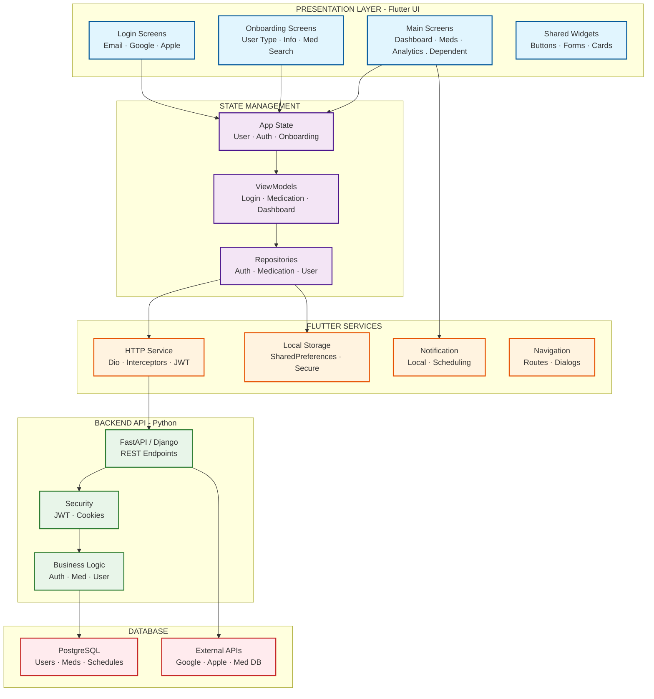
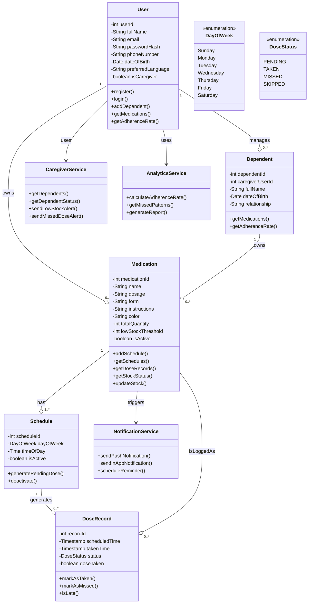
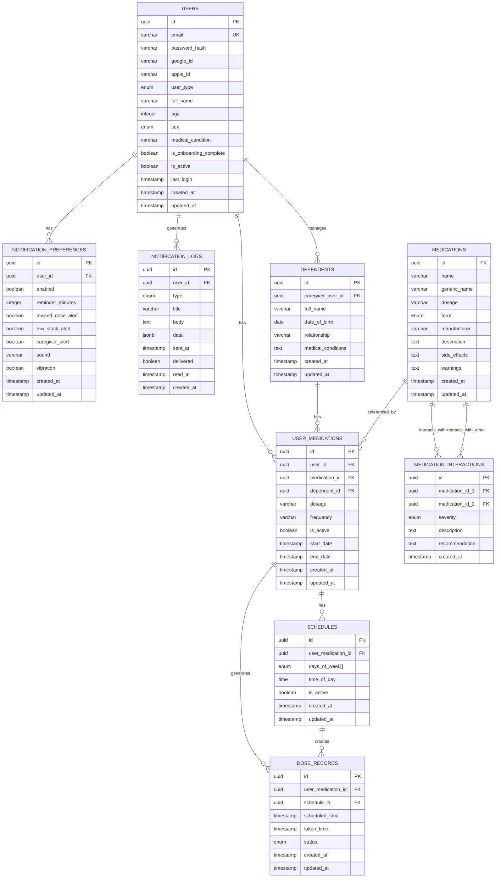

# User Stories for the Smart Medication app 

### MUST HAVE 

These features are essential for the application to function and provide core value to users.

---

**Story #1: User Registration**
> As a **new user**, I want to **register and create a secure account with my email and password**, so that **my medication data is private and accessible across my devices**.

- **Priority:** Must Have
- **Feature:** User Account Management (Registration)
- **Acceptance Criteria:**
  - User can enter email, password, and confirm password
  - System validates email format and password strength
  - User receives confirmation of successful registration
  - User is automatically logged in after registration

---

**Story #2: User Login**
> As a **registered user**, I want to **log into my account using a simple login screen**, so that **I can securely access my medication dashboard and personal information**.

- **Priority:** Must Have
- **Feature:** User Account Management (Login)
- **Acceptance Criteria:**
  - User can enter email and password
  - System validates credentials and grants access
  - Failed attempts show clear error messages
  - "Remember me" option is available

---

**Story #3: Add a New Medication**
> As an **elderly patient or caregiver**, I want to **add a new medication with its name, dosage, and schedule**, so that **I can keep an accurate and complete list of all my prescriptions in one place**.

- **Priority:** Must Have
- **Feature:** Medication Management (Add, View, Edit, Delete)
- **Acceptance Criteria:**
  - User can enter medication name, dosage (e.g., 500mg), and frequency
  - User can select schedule (times of day, days of week)
  - User can add notes (e.g., "take with food")
  - Medication is saved and appears in the dashboard
  - User can add at least 5 medications in under 2 minutes

---

**Story #4: View Today's Medications**
> As an **elderly patient**, I want to **see a clear, simple dashboard showing all my medications for today**, so that **I know exactly what I need to take and when**.

- **Priority:** Must Have
- **Feature:** Daily Medication Dashboard
- **Acceptance Criteria:**
  - Dashboard shows all medications scheduled for today
  - Each medication displays name, dosage, and scheduled time
  - Medications are grouped by time (morning, afternoon, evening)
  - Large, readable fonts are used (minimum 18px)
  - High contrast colors for easy visibility

---

**Story #5: Receive a Medication Reminder**
> As an **elderly patient**, I want to **receive a clear, easy-to-understand notification when a medication is due**, so that **I don't forget to take it on time**.

- **Priority:** Must Have
- **Feature:** Reminder Notification System
- **Acceptance Criteria:**
  - Notification triggers at the scheduled time
  - Notification includes medication name and dosage
  - Notification sound is clear and distinct
  - 95% of scheduled reminders are delivered within 1 minute of scheduled time

---

**Story #6: Record a Taken Dose**
> As a **patient**, I want to **receive a prompt after my scheduled medication time asking if I took my dose**, so that **I can easily record my adherence and the system can track my progress**.

- **Priority:** Must Have
- **Feature:** Post-dose prompt
- **Acceptance Criteria:**
  - Prompt appears 5-10 minutes after scheduled medication time
  - Prompt asks "Did you take [medication name]?"
  - User can select "Yes" or "No" with large buttons
  - Response is recorded in the adherence log

---

**Story #7: Track Adherence Rate**
> As a **patient and my doctor**, I want to **view my daily and weekly adherence rate (taken vs. not taken)**, so that **I can see how well I am sticking to my treatment plan**.

- **Priority:** Must Have
- **Feature:** Adherence rate calculation
- **Acceptance Criteria:**
  - Dashboard shows percentage of doses taken vs. missed
  - Daily adherence rate is displayed prominently
  - Weekly summary shows overall adherence trend
  - Data is presented in a simple, visual format (e.g., progress bar)

---

**Story #8: Mark a Dose as Missed**
> As a **patient**, I want to **see a clear list of any doses that have been missed**, so that **I can be aware of gaps in my adherence and take corrective action**.

- **Priority:** Must Have
- **Feature:** Adherence tracking / Missed dose reporting
- **Acceptance Criteria:**
  - Missed doses are highlighted in red or with a warning icon
  - User can view a list of all missed medications
  - System tracks the date and time of each missed dose

---

### SHOULD HAVE 

These features significantly enhance the user experience but can be added shortly after MVP launch.

---

**Story #9: Edit a Medication's Schedule**
> As a **patient**, I want to **easily edit the dosage or schedule of a medication**, so that **I can update the app when my prescription changes without having to delete and re-add it**.

- **Priority:** Should Have
- **Feature:** Medication Management (Edit)
- **Acceptance Criteria:**
  - User can tap on a medication to edit its details
  - All fields (name, dosage, schedule) are editable
  - Changes are saved and reflected immediately in the dashboard

---

**Story #10: Add a Dependent**
> As a **family caregiver**, I want to **add my elderly parent (or child, spouse) as a dependent in my account**, so that **I can manage and monitor their medications from my own app**.

- **Priority:** Should Have
- **Feature:** Add Dependents
- **Acceptance Criteria:**
  - User can add a dependent with name and relationship
  - User can switch between their own profile and dependent profiles
  - Each dependent has a separate medication list

---

**Story #11: View a Dependent's Medications**
> As a **family caregiver**, I want to **switch to a separate, dedicated page for each of my dependents**, so that **I can see and manage their medication schedules individually without confusing them with my own**.

- **Priority:** Should Have
- **Feature:** Separate page for each dependent
- **Acceptance Criteria:**
  - Each dependent has their own dashboard
  - Dashboard shows only that dependent's medications
  - Caregiver can easily switch between dependents

---

**Story #12: Search for a Specific Medication**
> As a **patient**, I want to **search for a medication by name**, so that **I can quickly find its details without having to scroll through a long list**.

- **Priority:** Should Have
- **Feature:** In-app Medication Search
- **Acceptance Criteria:**
  - Search bar is available on the dashboard
  - User can type medication name and see filtered results
  - Search is case-insensitive and supports partial matches

---

### COULD HAVE 

These features add value but are not essential for the initial launch.

---

**Story #13: Receive a Caregiver Alert for a Missed Dose**
> As a **family caregiver**, I want to **receive an alert if my elderly parent misses a critical dose**, so that **I can quickly follow up with them to ensure their safety**.

- **Priority:** Could Have
- **Feature:** Family or Caregiver Monitoring Dashboard
- **Acceptance Criteria:**
  - Caregiver receives a notification when a dependent misses a dose
  - Alert is sent via push notification or SMS
  - Alert includes the dependent's name and medication missed

---

**Story #14: Get a Low Stock Alert**
> As a **patient**, I want to **receive a notification when my pill quantity is running low**, so that **I can refill my prescription before I run out**.

- **Priority:** Could Have
- **Feature:** Pill quantity tracking with low stock alert
- **Acceptance Criteria:**
  - User can set a stock quantity for each medication
  - System sends an alert when stock falls below a threshold
  - Alert includes the medication name and quantity needed

---

**Story #15: Analyze Long-Term Adherence Patterns**
> As a **patient and my doctor**, I want to **view long-term analytics for missed medication patterns**, so that **we can identify trends and adjust my treatment plan if necessary**.

- **Priority:** Could Have
- **Feature:** Full tracking and analytics system for long-term missed medication patterns
- **Acceptance Criteria:**
  - Analytics shows missed doses over weeks or months
  - Trends are displayed in simple charts or graphs
  - Data can be shared with a doctor (e.g., export as PDF)

---

**Story #16: Receive a Drug Interaction Alert**
> As a **patient**, I want to **be warned if a newly added medication conflicts with an existing one**, so that **I can avoid potentially dangerous drug interactions**.

- **Priority:** Could Have
- **Feature:** Drug Interaction Detection
- **Acceptance Criteria:**
  - System checks new medication against existing list
  - Warning is displayed if interaction is detected
  - Warning includes details about the interaction

---

### WON'T HAVE 

These features are important for the future but will not be included in the initial release.

---

**Story #17: Scan Prescription with Pharmacy Integration**
> As a **patient**, I want to **scan my prescription barcode or upload a photo and have it automatically processed with pharmacy integration**, so that **I can instantly add medications to my schedule without manual entry and request refills directly from my local pharmacy**.

- **Priority:** Won't Have (Future Scope)
- **Feature:** Prescription Scanning & Pharmacy Integration
- **Reason:** This feature requires:
  - Advanced OCR and image recognition technology
  - Partnerships with pharmacies and healthcare providers
  - HIPAA/GDPR compliance for medical data sharing
  - Complex API integrations with pharmacy systems
  - Additional security and privacy considerations
  
  These requirements are beyond the MVP scope and will be developed in a future phase when the team has more resources and can establish necessary partnerships.

---

**Story #18: Order Medication Refills Directly from Pharmacy**
> As a **patient**, I want to **reorder my medications directly through the app and have them delivered from my preferred pharmacy**, so that **I never have to worry about running out of essential medications**.

- **Priority:** Won't Have (Future Scope)
- **Feature:** Pharmacy Order & Delivery Integration
- **Reason:** This feature requires:
  - Integration with pharmacy inventory systems
  - Payment gateway integration
  - Delivery logistics and tracking
  - Partnership agreements with pharmacies
  - Complex regulatory compliance for medication sales
  
  This is a significant feature that will be considered for Version 2.0 after establishing pharmacy partnerships.

---

**Story #19: Receive Pharmacy Promotions and Discounts**
> As a **patient**, I want to **receive notifications about medication discounts and promotions from partner pharmacies**, so that **I can save money on my prescriptions**.

- **Priority:** Won't Have (Future Scope)
- **Feature:** Pharmacy Promotions & Loyalty Program
- **Reason:** This feature requires:
  - Business partnerships with pharmacies
  - Marketing and promotion management system
  - User preference and opt-in/opt-out mechanisms
  - Commercial agreements and revenue sharing models
  
  This will be considered as a monetization feature in future versions.


---

### 3. UI Mockups for the app 


---


this is the System Architecture Diagram

Data Flow Diagram

```mermaid
sequenceDiagram
    participant User as User
    participant Mobile as Mobile/Web App
    participant CDN as Cloudflare CDN
    participant LB as Load Balancer
    participant Gateway as API Gateway
    participant Auth as Auth Service
    participant UserSvc as User Service
    participant MedSvc as Medication Service
    participant ScheduleSvc as Schedule Service
    participant NotifSvc as Notification Service
    participant Analytics as Analytics Service
    participant Cache as Redis Cache
    participant DB as PostgreSQL
    participant External as External Services

    %% ========== PHASE 1: USER LOGIN ==========
    rect rgb(220, 235, 250)
        Note over User,External: PHASE 1: AUTHENTICATION FLOW
        User->>Mobile: Enter Credentials
        Mobile->>CDN: POST /api/auth/login
        CDN->>LB: Forward Request
        LB->>Gateway: Route Request
        Gateway->>Gateway: Validate Request
        Gateway->>Auth: Authenticate User

        alt Email Login
            Auth->>DB: Query User by Email
            DB-->>Auth: User Data
            Auth->>Auth: Verify Password Hash
        else Google Login
            Auth->>External: Verify Google Token
            External-->>Auth: Token Valid
            Auth->>DB: Find/Create User
            DB-->>Auth: User Data
        else Apple Login
            Auth->>External: Verify Apple Token
            External-->>Auth: Token Valid
            Auth->>DB: Find/Create User
            DB-->>Auth: User Data
        end

        Auth->>Auth: Generate JWT Token
        Auth->>Cache: Store Session
        Cache-->>Auth: Session Stored
        Auth-->>Gateway: Return AuthResponse
        Gateway-->>LB: Response
        LB-->>CDN: Response
        CDN-->>Mobile: AuthResponse (JWT in Cookie)
        Mobile-->>User: Show Dashboard
    end

    %% ========== PHASE 2: LOAD DASHBOARD ==========
    rect rgb(235, 245, 220)
        Note over User,Analytics: PHASE 2: DASHBOARD LOAD
        User->>Mobile: View Dashboard
        Mobile->>CDN: GET /api/dashboard
        CDN->>LB: Forward Request
        LB->>Gateway: Route Request
        Gateway->>Gateway: Validate JWT
        Gateway->>Cache: Check Cache
        Cache-->>Gateway: Cache Miss

        par Parallel Dashboard Queries
            Gateway->>UserSvc: Get User Profile
            UserSvc->>DB: Query User
            DB-->>UserSvc: User Data
            UserSvc-->>Gateway: User Profile

            Gateway->>ScheduleSvc: Get Today's Medications
            ScheduleSvc->>DB: Query Schedules
            DB-->>ScheduleSvc: Schedule Data
            ScheduleSvc->>ScheduleSvc: Generate Doses
            ScheduleSvc-->>Gateway: Today's Doses

            Gateway->>Analytics: Get Adherence Rate
            Analytics->>DB: Query Dose Records
            DB-->>Analytics: Dose Data
            Analytics->>Analytics: Calculate Adherence
            Analytics-->>Gateway: Adherence Rate

            Gateway->>MedSvc: Get Low Stock Items
            MedSvc->>DB: Query Medications
            DB-->>MedSvc: Medication Data
            MedSvc-->>Gateway: Low Stock Items
        end

        Gateway->>Gateway: Aggregate Dashboard Data
        Gateway->>Cache: Cache Dashboard Data
        Cache-->>Gateway: Cached
        Gateway-->>LB: DashboardData
        LB-->>CDN: Response
        CDN-->>Mobile: Dashboard Data
        Mobile-->>User: Display Dashboard
    end

    %% ========== PHASE 3: ADD MEDICATION ==========
    rect rgb(255, 245, 230)
        Note over User,MedAPI: PHASE 3: ADD MEDICATION
        User->>Mobile: Search Medication
        Mobile->>CDN: GET /api/medications/search?q={query}
        CDN->>LB: Forward Request
        LB->>Gateway: Route Request
        Gateway->>Gateway: Validate JWT

        Gateway->>Cache: Check Search Cache
        alt Cache Hit
            Cache-->>Gateway: Search Results
        else Cache Miss
            Gateway->>MedSvc: Search Medications
            MedSvc->>MedAPI: Query Drug Database
            MedAPI-->>MedSvc: Drug Results
            MedSvc->>DB: Store/Cache Results
            MedSvc-->>Gateway: Search Results
            Gateway->>Cache: Cache Results
        end

        Gateway-->>LB: Search Results
        LB-->>CDN: Response
        CDN-->>Mobile: Medication List
        Mobile-->>User: Show Dropdown

        User->>Mobile: Select Medication & Submit
        Mobile->>CDN: POST /api/user/medications
        CDN->>LB: Forward Request
        LB->>Gateway: Route Request
        Gateway->>Gateway: Validate JWT
        Gateway->>MedSvc: Add User Medication

        MedSvc->>DB: Save UserMedication
        DB-->>MedSvc: Saved
        MedSvc->>ScheduleSvc: Create Schedule
        ScheduleSvc->>DB: Save Schedule
        DB-->>ScheduleSvc: Saved
        ScheduleSvc->>ScheduleSvc: Generate Doses
        ScheduleSvc->>DB: Save Dose Records
        DB-->>ScheduleSvc: Saved

        ScheduleSvc->>NotifSvc: Schedule Reminders
        NotifSvc->>External: Schedule Push Notification
        External-->>NotifSvc: Scheduled

        ScheduleSvc-->>MedSvc: Success
        MedSvc-->>Gateway: UserMedication Added
        Gateway-->>LB: Success Response
        LB-->>CDN: Response
        CDN-->>Mobile: Success
        Mobile-->>User: Medication Added
    end

    %% ========== PHASE 4: BACKGROUND PROCESSES ==========
    rect rgb(240, 245, 250)
        Note over Celery,NotifSvc: PHASE 4: BACKGROUND PROCESSES
        loop Every Minute
            Scheduler->>Celery: Trigger Dose Check
            Celery->>ScheduleSvc: Check Due Doses
            ScheduleSvc->>DB: Query Due Doses
            DB-->>ScheduleSvc: Due Doses
            ScheduleSvc-->>Celery: Due Doses

            loop For Each Due Dose
                Celery->>NotifSvc: Send Reminder
                NotifSvc->>External: Push Notification
                External-->>NotifSvc: Sent
                NotifSvc->>DB: Log Notification
                DB-->>NotifSvc: Logged
            end
        end

        loop Every Hour
            Scheduler->>Celery: Check Missed Doses
            Celery->>ScheduleSvc: Get Missed Doses
            ScheduleSvc->>DB: Query Missed Doses
            DB-->>ScheduleSvc: Missed Doses
            ScheduleSvc-->>Celery: Missed Doses

            loop For Each Missed Dose
                Celery->>NotifSvc: Send Missed Alert
                NotifSvc->>External: Push Notification
                External-->>NotifSvc: Sent
                NotifSvc->>DB: Log Notification
                DB-->>NotifSvc: Logged
            end
        end

        loop Every Day
            Scheduler->>Celery: Generate Daily Report
            Celery->>Analytics: Generate Report
            Analytics->>DB: Query Data
            DB-->>Analytics: All Data
            Analytics->>Analytics: Process Data
            Analytics->>FileStorage: Store Report
            FileStorage-->>Analytics: Stored
            Analytics-->>Celery: Report Generated
            Celery->>NotifSvc: Send Report Notification
            NotifSvc->>External: Push Notification
            External-->>NotifSvc: Sent
        end
    end
```

this is the class diagram 

```mermaid
classDiagram
    class User {
        -UUID id
        -String email
        -String? password_hash
        -String? google_id
        -String? apple_id
        -UserType user_type
        -String full_name
        -int age
        -Sex sex
        -String? medical_condition
        -bool is_onboarding_complete
        -bool is_active
        -DateTime last_login
        -DateTime created_at
        -DateTime updated_at
        +authenticate_email(email, password) User
        +authenticate_google(token) User
        +authenticate_apple(token) User
        +generate_jwt() String
        +verify_jwt(token) Dict
        +update_profile(data) User
        +complete_onboarding() bool
        +get_notification_preferences() NotificationPreference
        +get_medications() List~UserMedication~
        +get_dependents() List~Dependent~
        +get_adherence_rate(start_date, end_date) float
        +deactivate_account() bool
        +to_dict() Dict
    }

    class UserType {
        <<enumeration>>
        ELDERLY
        GENERAL_USER
        +display_names() Dict
        +from_string(value) UserType
    }

    class AuthResponse {
        -User user
        -String token
        -String refresh_token
        -DateTime expires_at
        -bool is_new_user
        -bool user_type_required
        -bool onboarding_complete
        +to_dict() Dict
        +to_cookie_data() Dict
        +from_dict(data) AuthResponse
    }

    class AuthService {
        +login(email, password) AuthResponse
        +login_with_google(token) AuthResponse
        +login_with_apple(token) AuthResponse
        +register_user(data) User
        +refresh_token(refresh_token) AuthResponse
        +logout(user_id) bool
        +validate_jwt(token) bool
        +get_current_user(token) User
        +reset_password(email) bool
    }

    class Medication {
        -UUID id
        -String name
        -String generic_name
        -String dosage
        -MedicationForm form
        -String? manufacturer
        -String? image_url
        -String? description
        -List~String~ side_effects
        -List~String~ warnings
        -bool is_prescription_required
        -DateTime created_at
        -DateTime updated_at
        +search(query) List~Medication~
        +get_by_id(id) Medication
        +get_by_name(name) List~Medication~
        +get_by_generic_name(generic_name) List~Medication~
        +get_interactions(medication_ids) List~MedicationInteraction~
        +to_dict() Dict
        +from_dict(data) Medication
    }

    class MedicationForm {
        <<enumeration>>
        TABLET
        CAPSULE
        LIQUID
        INJECTION
        CREAM
        INHALER
        OTHER
        +display_names() Dict
        +from_string(value) MedicationForm
    }

    class UserMedication {
        -UUID id
        -UUID user_id
        -UUID medication_id
        -UUID? dependent_id
        -String dosage
        -String frequency
        -String? notes
        -bool is_active
        -DateTime start_date
        -DateTime? end_date
        -DateTime created_at
        -DateTime updated_at
        +create(user_id, medication_id, dosage, frequency) UserMedication
        +update(data) UserMedication
        +deactivate() bool
        +add_schedule(schedule) Schedule
        +get_schedules() List~Schedule~
        +get_dose_records(start_date, end_date) List~DoseRecord~
        +get_adherence_rate() float
        +get_next_dose() DoseRecord
        +check_stock() StockStatus
        +to_dict() Dict
        +from_dict(data) UserMedication
    }

    class Schedule {
        -UUID id
        -UUID user_medication_id
        -List~DayOfWeek~ days_of_week
        -Time time_of_day
        -String? notes
        -bool is_active
        -DateTime created_at
        -DateTime updated_at
        +create(user_medication_id, days, time) Schedule
        +update(data) Schedule
        +deactivate() bool
        +activate() bool
        +generate_next_doses(days_ahead) List~DoseRecord~
        +get_next_occurrence() DateTime
        +is_due_now() bool
        +to_dict() Dict
        +from_dict(data) Schedule
    }

    class DayOfWeek {
        <<enumeration>>
        SUNDAY
        MONDAY
        TUESDAY
        WEDNESDAY
        THURSDAY
        FRIDAY
        SATURDAY
        +order() List
        +arabic_names() Dict
        +short_names() Dict
        +from_int(value) DayOfWeek
        +from_string(value) DayOfWeek
    }

    class DoseRecord {
        -UUID id
        -UUID user_medication_id
        -UUID schedule_id
        -DateTime scheduled_time
        -DateTime? taken_time
        -DoseStatus status
        -String? notes
        -DateTime created_at
        -DateTime updated_at
        +create(schedule_id, scheduled_time) DoseRecord
        +mark_as_taken(taken_time) DoseRecord
        +mark_as_missed() DoseRecord
        +mark_as_skipped() DoseRecord
        +is_late() bool
        +is_overdue() bool
        +get_status_display() String
        +get_time_until_due() timedelta
        +to_dict() Dict
        +from_dict(data) DoseRecord
    }

    class DoseStatus {
        <<enumeration>>
        PENDING
        TAKEN
        MISSED
        SKIPPED
        OVERDUE
        +display_names() Dict
        +color_map() Dict
        +icon_map() Dict
        +from_string(value) DoseStatus
    }

    class Dependent {
        -UUID id
        -UUID caregiver_user_id
        -String full_name
        -Date? date_of_birth
        -String relationship
        -String? profile_image_url
        -List~String~ medical_conditions
        -DateTime created_at
        -DateTime updated_at
        +create(caregiver_id, name, relationship) Dependent
        +update(data) Dependent
        +delete() bool
        +get_medications() List~UserMedication~
        +get_adherence_rate() float
        +get_medication_summary() Dict
        +share_with_caregiver(caregiver_email) bool
        +to_dict() Dict
        +from_dict(data) Dependent
    }

    class NotificationPreference {
        -UUID id
        -UUID user_id
        -bool enabled
        -int reminder_minutes
        -bool missed_dose_alert
        -bool low_stock_alert
        -bool caregiver_alert
        -String? sound
        -bool vibration
        -DateTime created_at
        -DateTime updated_at
        +get_by_user(user_id) NotificationPreference
        +update(data) NotificationPreference
        +enable() NotificationPreference
        +disable() NotificationPreference
        +set_reminder_time(minutes) NotificationPreference
        +should_send_reminder(dose) bool
        +to_dict() Dict
        +from_dict(data) NotificationPreference
    }

    class NotificationLog {
        -UUID id
        -UUID user_id
        -NotificationType type
        -String title
        -String body
        -Dict? data
        -DateTime sent_at
        -bool delivered
        -DateTime? read_at
        -DateTime created_at
        +log_notification(user_id, type, title, body) NotificationLog
        +mark_delivered() NotificationLog
        +mark_read() NotificationLog
        +get_unread_count(user_id) int
        +get_user_notifications(user_id, limit) List~NotificationLog~
        +to_dict() Dict
        +from_dict(data) NotificationLog
    }

    class NotificationType {
        <<enumeration>>
        MEDICATION_REMINDER
        MISSED_DOSE
        LOW_STOCK
        ADHERENCE_REPORT
        CAREGIVER_ALERT
        +display_names() Dict
        +from_string(value) NotificationType
    }

    %% Relationships
    User "1" --> "0..*" UserMedication : has
    User "1" --> "0..*" Dependent : manages
    User "1" --> "1" NotificationPreference : has
    User "1" --> "0..*" NotificationLog : generates

    Medication "1" --> "0..*" UserMedication : referenced_by
    Medication "1" --> "0..*" MedicationInteraction : interacts_with

    UserMedication "1" --> "1" Medication : references
    UserMedication "1" --> "0..*" Schedule : has
    UserMedication "1" --> "0..*" DoseRecord : generates
    UserMedication "0..*" --> "1" Dependent : belongs_to

    Schedule "1" --> "0..*" DoseRecord : creates
    DoseRecord "0..*" --> "1" Schedule : from
    DoseRecord "0..*" --> "1" UserMedication : for

    AuthService --> UserRepository : uses
    AuthService --> UserMedicationRepository : uses
    MedicationService --> MedicationRepository : uses
    MedicationService --> UserMedicationRepository : uses
    ScheduleService --> UserMedicationRepository : uses
    ScheduleService --> DoseRecordRepository : uses
    DoseTrackingService --> DoseRecordRepository : uses
    NotificationService --> NotificationPreference : uses
    NotificationService --> NotificationLog : uses
```


the ER diagram 


## SQL Schema

**4.1 Enums**
```
-- ==================== ENUMS ====================

CREATE TYPE user_type_enum AS ENUM ('general_user');
CREATE TYPE sex_enum AS ENUM ('male', 'female', 'other');
CREATE TYPE dose_status_enum AS ENUM ('pending', 'taken', 'missed', 'skipped', 'overdue');
CREATE TYPE day_of_week_enum AS ENUM ('sunday', 'monday', 'tuesday', 'wednesday', 'thursday', 'friday', 'saturday');
CREATE TYPE medication_form_enum AS ENUM ('tablet', 'capsule', 'liquid', 'injection', 'cream', 'inhaler', 'other');
CREATE TYPE notification_type_enum AS ENUM ('medication_reminder', 'missed_dose', 'low_stock', 'adherence_report', 'caregiver_alert');
CREATE TYPE interaction_severity_enum AS ENUM ('minor', 'moderate', 'major', 'contraindicated');
```

**4.2 Tables**
```
-- ==================== TABLES ====================

-- Users Table
CREATE TABLE users (
    id UUID PRIMARY KEY DEFAULT gen_random_uuid(),
    email VARCHAR(255) UNIQUE NOT NULL,
    password_hash VARCHAR(255),
    google_id VARCHAR(255),
    apple_id VARCHAR(255),
    user_type user_type_enum NOT NULL DEFAULT 'general_user',
    full_name VARCHAR(255) NOT NULL,
    age INTEGER NOT NULL CHECK (age >= 0 AND age <= 150),
    sex sex_enum NOT NULL,
    medical_condition VARCHAR(500),
    is_onboarding_complete BOOLEAN DEFAULT FALSE,
    is_active BOOLEAN DEFAULT TRUE,
    last_login TIMESTAMP,
    created_at TIMESTAMP DEFAULT CURRENT_TIMESTAMP,
    updated_at TIMESTAMP DEFAULT CURRENT_TIMESTAMP
);

-- Dependents Table
CREATE TABLE dependents (
    id UUID PRIMARY KEY DEFAULT gen_random_uuid(),
    caregiver_user_id UUID NOT NULL REFERENCES users(id) ON DELETE CASCADE,
    full_name VARCHAR(255) NOT NULL,
    date_of_birth DATE,
    relationship VARCHAR(100) NOT NULL,
    medical_conditions TEXT,
    created_at TIMESTAMP DEFAULT CURRENT_TIMESTAMP,
    updated_at TIMESTAMP DEFAULT CURRENT_TIMESTAMP
);

-- Medications Table (Master Drug Database)
CREATE TABLE medications (
    id UUID PRIMARY KEY DEFAULT gen_random_uuid(),
    name VARCHAR(255) NOT NULL,
    generic_name VARCHAR(255) NOT NULL,
    dosage VARCHAR(100) NOT NULL,
    form medication_form_enum NOT NULL,
    manufacturer VARCHAR(255),
    description TEXT,
    side_effects TEXT,
    warnings TEXT,
    is_prescription_required BOOLEAN DEFAULT FALSE,
    created_at TIMESTAMP DEFAULT CURRENT_TIMESTAMP,
    updated_at TIMESTAMP DEFAULT CURRENT_TIMESTAMP
);

-- User Medications Table
CREATE TABLE user_medications (
    id UUID PRIMARY KEY DEFAULT gen_random_uuid(),
    user_id UUID NOT NULL REFERENCES users(id) ON DELETE CASCADE,
    medication_id UUID NOT NULL REFERENCES medications(id),
    dependent_id UUID REFERENCES dependents(id) ON DELETE CASCADE,
    dosage VARCHAR(100) NOT NULL,
    frequency VARCHAR(100) NOT NULL,
    notes TEXT,
    is_active BOOLEAN DEFAULT TRUE,
    start_date TIMESTAMP NOT NULL DEFAULT CURRENT_TIMESTAMP,
    end_date TIMESTAMP,
    created_at TIMESTAMP DEFAULT CURRENT_TIMESTAMP,
    updated_at TIMESTAMP DEFAULT CURRENT_TIMESTAMP,
    CONSTRAINT either_user_or_dependent CHECK (
        (user_id IS NOT NULL AND dependent_id IS NULL) OR
        (user_id IS NULL AND dependent_id IS NOT NULL)
    )
);

-- Schedules Table
CREATE TABLE schedules (
    id UUID PRIMARY KEY DEFAULT gen_random_uuid(),
    user_medication_id UUID NOT NULL REFERENCES user_medications(id) ON DELETE CASCADE,
    days_of_week day_of_week_enum[] NOT NULL,
    time_of_day TIME NOT NULL,
    notes VARCHAR(255),
    is_active BOOLEAN DEFAULT TRUE,
    created_at TIMESTAMP DEFAULT CURRENT_TIMESTAMP,
    updated_at TIMESTAMP DEFAULT CURRENT_TIMESTAMP
);

-- Dose Records Table
CREATE TABLE dose_records (
    id UUID PRIMARY KEY DEFAULT gen_random_uuid(),
    user_medication_id UUID NOT NULL REFERENCES user_medications(id) ON DELETE CASCADE,
    schedule_id UUID NOT NULL REFERENCES schedules(id) ON DELETE CASCADE,
    scheduled_time TIMESTAMP NOT NULL,
    taken_time TIMESTAMP,
    status dose_status_enum DEFAULT 'pending',
    notes VARCHAR(255),
    created_at TIMESTAMP DEFAULT CURRENT_TIMESTAMP,
    updated_at TIMESTAMP DEFAULT CURRENT_TIMESTAMP
);

-- Notification Preferences Table
CREATE TABLE notification_preferences (
    id UUID PRIMARY KEY DEFAULT gen_random_uuid(),
    user_id UUID NOT NULL UNIQUE REFERENCES users(id) ON DELETE CASCADE,
    enabled BOOLEAN DEFAULT TRUE,
    reminder_minutes INTEGER DEFAULT 15,
    missed_dose_alert BOOLEAN DEFAULT TRUE,
    low_stock_alert BOOLEAN DEFAULT TRUE,
    caregiver_alert BOOLEAN DEFAULT TRUE,
    sound VARCHAR(100),
    vibration BOOLEAN DEFAULT TRUE,
    created_at TIMESTAMP DEFAULT CURRENT_TIMESTAMP,
    updated_at TIMESTAMP DEFAULT CURRENT_TIMESTAMP
);

-- Notification Logs Table
CREATE TABLE notification_logs (
    id UUID PRIMARY KEY DEFAULT gen_random_uuid(),
    user_id UUID NOT NULL REFERENCES users(id) ON DELETE CASCADE,
    type notification_type_enum NOT NULL,
    title VARCHAR(255) NOT NULL,
    body TEXT NOT NULL,
    data JSONB,
    sent_at TIMESTAMP NOT NULL DEFAULT CURRENT_TIMESTAMP,
    delivered BOOLEAN DEFAULT FALSE,
    read_at TIMESTAMP,
    created_at TIMESTAMP DEFAULT CURRENT_TIMESTAMP
);

-- Medication Interactions Table
CREATE TABLE medication_interactions (
    id UUID PRIMARY KEY DEFAULT gen_random_uuid(),
    medication_id_1 UUID NOT NULL REFERENCES medications(id) ON DELETE CASCADE,
    medication_id_2 UUID NOT NULL REFERENCES medications(id) ON DELETE CASCADE,
    severity interaction_severity_enum NOT NULL,
    description TEXT NOT NULL,
    recommendation TEXT,
    created_at TIMESTAMP DEFAULT CURRENT_TIMESTAMP,
    CONSTRAINT different_medications CHECK (medication_id_1 != medication_id_2)
);
```

**4.3 Indexes**
```
-- ==================== INDEXES ====================

-- Users Table Indexes
CREATE INDEX idx_users_email ON users(email);
CREATE INDEX idx_users_user_type ON users(user_type);
CREATE INDEX idx_users_is_active ON users(is_active);

-- User Medications Table Indexes
CREATE INDEX idx_user_medications_user_id ON user_medications(user_id);
CREATE INDEX idx_user_medications_medication_id ON user_medications(medication_id);
CREATE INDEX idx_user_medications_dependent_id ON user_medications(dependent_id);
CREATE INDEX idx_user_medications_is_active ON user_medications(is_active);

-- Schedules Table Indexes
CREATE INDEX idx_schedules_user_medication_id ON schedules(user_medication_id);
CREATE INDEX idx_schedules_is_active ON schedules(is_active);

-- Dose Records Table Indexes
CREATE INDEX idx_dose_records_user_medication_id ON dose_records(user_medication_id);
CREATE INDEX idx_dose_records_schedule_id ON dose_records(schedule_id);
CREATE INDEX idx_dose_records_scheduled_time ON dose_records(scheduled_time);
CREATE INDEX idx_dose_records_status ON dose_records(status);

-- Dependents Table Indexes
CREATE INDEX idx_dependents_caregiver_user_id ON dependents(caregiver_user_id);

-- Notification Logs Table Indexes
CREATE INDEX idx_notification_logs_user_id ON notification_logs(user_id);
CREATE INDEX idx_notification_logs_sent_at ON notification_logs(sent_at);

-- Medication Interactions Table Indexes
CREATE INDEX idx_medication_interactions_med1 ON medication_interactions(medication_id_1);
CREATE INDEX idx_medication_interactions_med2 ON medication_interactions(medication_id_2);
```

**4.4 Triggers**
```
-- ==================== TRIGGERS ====================

-- Update updated_at on users
CREATE OR REPLACE FUNCTION update_updated_at_column()
RETURNS TRIGGER AS $$
BEGIN
    NEW.updated_at = CURRENT_TIMESTAMP;
    RETURN NEW;
END;
$$ LANGUAGE plpgsql;

CREATE TRIGGER update_users_updated_at
    BEFORE UPDATE ON users
    FOR EACH ROW
    EXECUTE FUNCTION update_updated_at_column();

CREATE TRIGGER update_dependents_updated_at
    BEFORE UPDATE ON dependents
    FOR EACH ROW
    EXECUTE FUNCTION update_updated_at_column();

CREATE TRIGGER update_medications_updated_at
    BEFORE UPDATE ON medications
    FOR EACH ROW
    EXECUTE FUNCTION update_updated_at_column();

CREATE TRIGGER update_user_medications_updated_at
    BEFORE UPDATE ON user_medications
    FOR EACH ROW
    EXECUTE FUNCTION update_updated_at_column();

CREATE TRIGGER update_schedules_updated_at
    BEFORE UPDATE ON schedules
    FOR EACH ROW
    EXECUTE FUNCTION update_updated_at_column();

CREATE TRIGGER update_dose_records_updated_at
    BEFORE UPDATE ON dose_records
    FOR EACH ROW
    EXECUTE FUNCTION update_updated_at_column();

CREATE TRIGGER update_notification_preferences_updated_at
    BEFORE UPDATE ON notification_preferences
    FOR EACH ROW
    EXECUTE FUNCTION update_updated_at_column();
```

## 5 Sample Queries
**5.1 Get Today's Medications for a User**
```
SELECT 
    m.name AS medication_name,
    um.dosage,
    um.frequency,
    s.time_of_day,
    s.days_of_week,
    um.notes
FROM user_medications um
JOIN medications m ON um.medication_id = m.id
JOIN schedules s ON s.user_medication_id = um.id
WHERE um.user_id = 'user-uuid-here'
    AND um.is_active = TRUE
    AND s.is_active = TRUE
    AND CURRENT_DATE = ANY(
        SELECT unnest(s.days_of_week)
        WHERE s.days_of_week && ARRAY[to_char(CURRENT_DATE, 'day')]
    )
ORDER BY s.time_of_day;
```
**5.2 Calculate Adherence Rate**
```
SELECT 
    um.id AS user_medication_id,
    m.name AS medication_name,
    COUNT(dr.id) AS total_doses,
    COUNT(CASE WHEN dr.status = 'taken' THEN 1 END) AS taken_doses,
    ROUND(
        (COUNT(CASE WHEN dr.status = 'taken' THEN 1 END)::DECIMAL / 
        NULLIF(COUNT(dr.id), 0) * 100), 2
    ) AS adherence_rate
FROM user_medications um
JOIN medications m ON um.medication_id = m.id
JOIN dose_records dr ON dr.user_medication_id = um.id
WHERE um.user_id = 'user-uuid-here'
    AND dr.scheduled_time BETWEEN '2024-01-01' AND '2024-12-31'
GROUP BY um.id, m.name
ORDER BY adherence_rate DESC;
```
**5.3 Get Missed Doses**
```
SELECT 
    m.name AS medication_name,
    dr.scheduled_time,
    dr.status,
    CASE 
        WHEN dr.scheduled_time < CURRENT_TIMESTAMP - INTERVAL '1 hour' 
        AND dr.status != 'taken' 
        THEN 'OVERDUE' 
        ELSE 'MISSED' 
    END AS severity
FROM dose_records dr
JOIN user_medications um ON dr.user_medication_id = um.id
JOIN medications m ON um.medication_id = m.id
WHERE um.user_id = 'user-uuid-here'
    AND dr.status IN ('pending', 'missed')
    AND dr.scheduled_time < CURRENT_TIMESTAMP
ORDER BY dr.scheduled_time ASC;
```
**5.4 Check Medication Interactions**
```
SELECT 
    m1.name AS medication_1,
    m2.name AS medication_2,
    mi.severity,
    mi.description,
    mi.recommendation
FROM medication_interactions mi
JOIN medications m1 ON mi.medication_id_1 = m1.id
JOIN medications m2 ON mi.medication_id_2 = m2.id
WHERE mi.medication_id_1 IN (
    SELECT medication_id FROM user_medications WHERE user_id = 'user-uuid-here' AND is_active = TRUE
)
AND mi.medication_id_2 IN (
    SELECT medication_id FROM user_medications WHERE user_id = 'user-uuid-here' AND is_active = TRUE
)
ORDER BY 
    CASE mi.severity
        WHEN 'contraindicated' THEN 1
        WHEN 'major' THEN 2
        WHEN 'moderate' THEN 3
        WHEN 'minor' THEN 4
    END;
```
**5.5 Get Weekly Adherence Summary**
```
SELECT 
    DATE_TRUNC('week', dr.scheduled_time) AS week_start,
    COUNT(dr.id) AS total_doses,
    COUNT(CASE WHEN dr.status = 'taken' THEN 1 END) AS taken_doses,
    ROUND(
        (COUNT(CASE WHEN dr.status = 'taken' THEN 1 END)::DECIMAL / 
        NULLIF(COUNT(dr.id), 0) * 100), 2
    ) AS adherence_rate
FROM dose_records dr
JOIN user_medications um ON dr.user_medication_id = um.id
WHERE um.user_id = 'user-uuid-here'
    AND dr.scheduled_time >= CURRENT_DATE - INTERVAL '30 days'
GROUP BY DATE_TRUNC('week', dr.scheduled_time)
ORDER BY week_start DESC;
```
---
## High-Level Sequence Diagrams - Key Use Cases

High-level sequence diagrams for the 3 most critical use cases in your Smart Medication Management System.

**Use Case 1: User Login & Authentication**

```mermaid

sequenceDiagram
    participant User as  User
    participant UI as  Flutter App
    participant CDN as  CDN
    participant LB as Load Balancer
    participant Gateway as API Gateway
    participant Auth as Auth Service
    participant UserSvc as User Service
    participant Cache as Redis Cache
    participant DB as PostgreSQL
    participant Google as Google OAuth
    participant Apple as Apple OAuth

    rect rgb(220, 235, 250)
        Note over User,Apple: STEP 1: USER LOGIN
        User->>UI: Open App
        UI->>UI: Check Local Storage for Token
        
        alt Token Exists & Valid
            UI->>User: Navigate to Dashboard
        else No Token / Invalid
            UI-->>User: Show Login Screen
        end

        User->>UI: Enter Email & Password
        User->>UI: Tap "Login" Button
        
        UI->>UI: Validate Inputs
        UI->>CDN: POST /api/auth/login
        Note over UI,CDN: {email, password}
        
        CDN->>CDN: SSL Termination & DDoS Check
        CDN->>LB: Forward Request
        LB->>LB: Health Check & Routing
        LB->>Gateway: Route Request
        
        Gateway->>Gateway: Validate Request Format
        Gateway->>Auth: Authenticate User
    end

    rect rgb(235, 245, 220)
        Note over Auth,Google: STEP 2: EMAIL AUTHENTICATION
        
        alt Email Login
            Auth->>DB: SELECT * FROM users WHERE email = ?
            DB-->>Auth: Return User Data
            
            Auth->>Auth: Verify Password Hash
            
            alt Invalid Credentials
                Auth-->>Gateway: Authentication Failed
                Gateway-->>UI: 401 Unauthorized
                UI-->>User: Show Error Message
            else Valid Credentials
                Auth->>Auth: Generate JWT Token
                Auth->>Cache: SET session:{user_id} = token
                Note over Auth,Cache: TTL: 24 hours
                Cache-->>Auth: Token Stored
            end
        end
        
        rect rgb(250, 240, 230)
            Note over Auth,Google: STEP 3: SOCIAL AUTHENTICATION (Optional)
            
            alt Google Login
                User->>UI: Tap "Continue with Google"
                UI->>UI: Show Google OAuth Screen
                User->>UI: Select Google Account
                UI->>Google: Request Google Token
                Google-->>UI: Return Google Token
                UI->>CDN: POST /api/auth/google
                Note over UI,CDN: {token: "google_token"}
                
                CDN->>LB: Forward Request
                LB->>Gateway: Route Request
                Gateway->>Auth: Authenticate with Google
                Auth->>Google: Verify Google Token
                Google-->>Auth: Token Valid & User Info
                Auth->>DB: SELECT * FROM users WHERE google_id = ?
                DB-->>Auth: Return User Data
                
                alt User Exists
                    Auth->>Auth: Generate JWT Token
                else New User
                    Auth->>DB: INSERT INTO users (...)
                    DB-->>Auth: User Created
                    Auth->>Auth: Generate JWT Token
                    Auth->>Auth: Set user_type_required = True
                end
            end
            
            alt Apple Login
                User->>UI: Tap "Continue with Apple"
                UI->>UI: Show Apple OAuth Screen
                User->>UI: Authenticate with Apple
                UI->>Apple: Request Apple Token
                Apple-->>UI: Return Apple Token
                UI->>CDN: POST /api/auth/apple
                Note over UI,CDN: {token: "apple_token"}
                
                CDN->>LB: Forward Request
                LB->>Gateway: Route Request
                Gateway->>Auth: Authenticate with Apple
                Auth->>Apple: Verify Apple Token
                Apple-->>Auth: Token Valid & User Info
                Auth->>DB: SELECT * FROM users WHERE apple_id = ?
                DB-->>Auth: Return User Data
                
                alt User Exists
                    Auth->>Auth: Generate JWT Token
                else New User
                    Auth->>DB: INSERT INTO users (...)
                    DB-->>Auth: User Created
                    Auth->>Auth: Generate JWT Token
                    Auth->>Auth: Set user_type_required = True
                end
            end
        end
    end

    rect rgb(240, 248, 255)
        Note over User,DB: STEP 4: LOAD USER PROFILE
        
        Auth->>Cache: GET user:{user_id}:profile
        alt Cache Hit
            Cache-->>Auth: Return Cached User Profile
            Auth->>Auth: Build Auth Response
        else Cache Miss
            Auth->>DB: SELECT * FROM users WHERE id = ?
            DB-->>Auth: Return User Data
            Auth->>Cache: SET user:{user_id}:profile
            Note over Auth,Cache: TTL: 1 hour
            Cache-->>Auth: Profile Stored
        end
        
        Auth-->>Gateway: Return AuthResponse
        Note over Auth,Gateway: {token, user, expires_at}
        
        Gateway->>Gateway: Set HTTP-Only Cookie
        Gateway-->>LB: Return Response
        LB-->>CDN: Return Response
        CDN-->>UI: Return AuthResponse
        
        UI->>Cache: Store Token in Secure Storage
        UI-->>User: Show Loading Screen
        UI->>User: Navigate to Dashboard
        User-->>UI: View Dashboard
    end

    rect rgb(255, 245, 230)
        Note over User,DB: STEP 5: USER TYPE & ONBOARDING (New Users)
        
        alt New User (user_type_required)
            UI->>UI: Show User Type Selection
            User->>UI: Select User Type
            Note over User,UI: General User
            
            User->>UI: Tap Continue
            UI->>CDN: POST /api/user/type
            Note over UI,CDN: {user_type: "elderly"}
            
            CDN->>LB: Forward Request
            LB->>Gateway: Route Request
            Gateway->>UserSvc: Update User Type
            UserSvc->>DB: UPDATE users SET user_type = ?
            DB-->>UserSvc: Updated
            UserSvc-->>Gateway: Success
            Gateway-->>UI: Success
            
            UI->>UI: Show User Info Form
            User->>UI: Enter Name, Age, Sex
            User->>UI: (Optional) Medical Condition
            User->>UI: Tap Save
            
            UI->>CDN: PUT /api/user/info
            CDN->>LB: Forward Request
            LB->>Gateway: Route Request
            Gateway->>UserSvc: Update User Profile
            UserSvc->>DB: UPDATE users SET name, age, sex, medical_condition
            DB-->>UserSvc: Updated
            UserSvc-->>Gateway: Success
            Gateway-->>UI: Success
            
            UI-->>User: Show "Onboarding Complete"
            UI->>User: Navigate to Medication Search
        end
    end
```


**Use Case 2: Add New Medication with Schedule**

```mermaid
sequenceDiagram
    participant User as User
    participant UI as Flutter App
    participant CDN as CDN
    participant LB as Load Balancer
    participant Gateway as API Gateway
    participant MedSvc as Medication Service
    participant UserMedSvc as UserMedication Service
    participant ScheduleSvc as Schedule Service
    participant NotifSvc as Notification Service
    participant Analytics as Analytics Service
    participant Cache as Redis Cache
    participant DB as PostgreSQL
    participant External as Drug Database API
    participant Push as Push Service

    rect rgb(220, 235, 250)
        Note over User,Push: STEP 1: SEARCH MEDICATION
        
        User->>UI: View Dashboard
        User->>UI: Tap "Add Medication" Button
        UI-->>User: Show Medication Search Screen
        UI->>UI: Display Search Bar
        
        User->>UI: Type Medication Name
        UI->>UI: Debounce (300ms)
        UI->>CDN: GET /api/medications/search?q={query}
        
        CDN->>CDN: SSL & Cache Check
        CDN->>LB: Forward Request
        LB->>LB: Health Check & Routing
        LB->>Gateway: Route Request
        
        Gateway->>Gateway: Validate JWT Token
        Gateway->>Cache: Check Search Cache
        
        alt Cache Hit
            Cache-->>Gateway: Return Cached Results
        else Cache Miss
            Gateway->>MedSvc: Search Medications
            MedSvc->>External: Query Drug Database
            Note over MedSvc,External: GET /api/drugs/search?q={query}
            External-->>MedSvc: Return Drug Results
            
            MedSvc->>MedSvc: Process & Enrich Results
            MedSvc->>Cache: SET search:{query} = results
            Note over MedSvc,Cache: TTL: 1 hour
            Cache-->>MedSvc: Results Stored
            MedSvc-->>Gateway: Return Search Results
        end
        
        Gateway-->>LB: Return Results
        LB-->>CDN: Return Results
        CDN-->>UI: Return Medication List
        
        UI-->>User: Show Dropdown Suggestions
        User->>UI: Select Medication from Dropdown
        
        alt No Medication Found
            UI-->>User: Show "No results found"
            User->>UI: Try Different Search
        else Medication Selected
            UI->>UI: Store Selected Medication
            User->>UI: Tap "Next" Button
            UI->>UI: Navigate to Dosage Form
        end
    end

    rect rgb(235, 245, 220)
        Note over User,DB: STEP 2: SET DOSAGE & SCHEDULE
        
        UI-->>User: Show Dosage Form
        User->>UI: Select Dosage
        Note over User,UI: e.g., 500mg, 10mg, etc.
        
        User->>UI: Select Frequency
        Note over User,UI: e.g., Once Daily, Twice Daily, etc.
        
        User->>UI: Set Schedule (Days & Time)
        Note over User,UI: e.g., Monday-Friday, 8:00 AM
        
        User->>UI: (Optional) Add Notes
        User->>UI: Tap "Add Medication" Button
        
        UI->>UI: Validate Form
        UI->>CDN: POST /api/user/medications
        Note over UI,CDN: {medication_id, dosage, frequency, schedules}
        
        CDN->>LB: Forward Request
        LB->>Gateway: Route Request
        Gateway->>Gateway: Validate JWT Token
        Gateway->>UserMedSvc: Create User Medication
    end

    rect rgb(240, 248, 255)
        Note over User,DB: STEP 3: SAVE USER MEDICATION
        
        UserMedSvc->>UserMedSvc: Validate Medication Data
        UserMedSvc->>DB: BEGIN TRANSACTION
        
        UserMedSvc->>DB: INSERT INTO user_medications (...)
        Note over UserMedSvc,DB: user_id, medication_id, dosage, frequency
        DB-->>UserMedSvc: UserMedication Created
        
        UserMedSvc->>ScheduleSvc: Create Schedules
        Note over UserMedSvc,ScheduleSvc: {user_medication_id, days, time}
        
        loop For Each Schedule
            ScheduleSvc->>DB: INSERT INTO schedules (...)
            Note over ScheduleSvc,DB: user_medication_id, days_of_week, time
            DB-->>ScheduleSvc: Schedule Created
        end
        
        ScheduleSvc->>ScheduleSvc: Generate Dose Records (7 days)
        
        loop For Each Dose
            ScheduleSvc->>DB: INSERT INTO dose_records (...)
            Note over ScheduleSvc,DB: schedule_id, user_medication_id, scheduled_time
            DB-->>ScheduleSvc: Dose Record Created
        end
        
        ScheduleSvc->>Cache: Delete Dashboard Cache
        Note over ScheduleSvc,Cache: user:{user_id}:dashboard
        Cache-->>ScheduleSvc: Cache Invalidated
        
        ScheduleSvc-->>UserMedSvc: Schedules & Doses Created
        UserMedSvc->>DB: COMMIT TRANSACTION
        DB-->>UserMedSvc: Transaction Complete
        
        UserMedSvc->>MedSvc: Check Interactions
        MedSvc->>MedSvc: Get User's Other Medications
        MedSvc->>External: Check Drug Interactions
        Note over MedSvc,External: Check interactions with other meds
        External-->>MedSvc: Interaction Results
        
        alt Interactions Found
            MedSvc->>MedSvc: Save Interaction Results
            MedSvc-->>UserMedSvc: Return Interaction Warnings
            UserMedSvc-->>Gateway: Return Warnings
            Gateway-->>UI: Return Warnings
            UI-->>User: Show Interaction Warnings
            User->>UI: Acknowledge Warnings
            User->>UI: Tap "Continue"
        end
        
        UserMedSvc-->>Gateway: UserMedication Created
        Gateway-->>LB: Success Response
        LB-->>CDN: Success Response
        CDN-->>UI: Success Response
        
        UI-->>User: Show "Medication Added" Confirmation
        User->>UI: Tap "Next" Button
        UI->>UI: Navigate to Notification Setup
    end

    rect rgb(255, 245, 230)
        Note over User,Push: STEP 4: NOTIFICATION SETUP
        
        UI-->>User: Show Notification Preferences
        User->>UI: Toggle "Enable Notifications"
        User->>UI: Set Reminder Minutes (15 min)
        User->>UI: Toggle "Missed Dose Alert"
        User->>UI: Toggle "Caregiver Alert"
        User->>UI: Tap "Save Preferences"
        
        UI->>CDN: POST /api/user/notification-preferences
        Note over UI,CDN: {enabled, reminder_minutes, missed_dose_alert}
        
        CDN->>LB: Forward Request
        LB->>Gateway: Route Request
        Gateway->>Gateway: Validate JWT Token
        Gateway->>NotifSvc: Save Preferences
        
        NotifSvc->>DB: UPSERT INTO notification_preferences
        Note over NotifSvc,DB: user_id, enabled, reminder_minutes, alerts
        DB-->>NotifSvc: Preferences Saved
        
        NotifSvc->>NotifSvc: Request Notification Permission
        NotifSvc-->>Gateway: Success
        Gateway-->>LB: Success
        LB-->>CDN: Success
        CDN-->>UI: Success
        
        NotifSvc->>ScheduleSvc: Get User's Active Schedules
        ScheduleSvc->>DB: SELECT * FROM schedules WHERE user_medication_id IN (...)
        DB-->>ScheduleSvc: Return Schedules
        
        loop For Each Schedule
            NotifSvc->>Push: Schedule Local Notification
            Note over NotifSvc,Push: {title, body, trigger_time}
            Push-->>NotifSvc: Notification Scheduled
        end
        
        NotifSvc->>DB: Save Notification Logs
        DB-->>NotifSvc: Logged
        
        UI-->>User: Show "Notifications Configured"
        User->>UI: Tap "Complete"
        UI->>UI: Navigate to Congratulations Screen
    end
```


**Use Case 3: Mark Dose as Taken & Update Dashboard**

```mermaid
sequenceDiagram
    participant User as User
    participant UI as Flutter App
    participant CDN as CDN
    participant LB as Load Balancer
    participant Gateway as API Gateway
    participant DoseSvc as Dose Tracking Service
    participant MedSvc as Medication Service
    participant NotifSvc as Notification Service
    participant Analytics as Analytics Service
    participant Cache as Redis Cache
    participant DB as PostgreSQL
    participant Push as  Push Service

    rect rgb(220, 235, 250)
        Note over User,Push: STEP 1: RECEIVE NOTIFICATION & OPEN APP
        
        Push->>User: Push Notification
        Note over Push,User: " Time to take Metformin 500mg"
        
        User->>UI: Tap Notification
        UI->>UI: Open App
        
        alt User Already Logged In
            UI->>UI: Navigate to Dashboard
            UI-->>User: Show Dashboard
        else User Not Logged In
            UI->>UI: Show Login Screen
            User->>UI: Login
            UI->>UI: Navigate to Dashboard
            UI-->>User: Show Dashboard
        end
        
        UI->>UI: Check for Pending Notifications
        UI->>Cache: Get Pending Doses
        Cache-->>UI: Return Pending Doses
        UI-->>User: Show Medication Card with "Take" Button
    end

    rect rgb(235, 245, 220)
        Note over User,DB: STEP 2: MARK DOSE AS TAKEN
        
        User->>UI: Tap "Take" Button on Medication Card
        
        UI->>UI: Show Confirmation Dialog
        User->>UI: Confirm "Mark as Taken"
        
        UI->>CDN: PUT /api/doses/{dose_id}/taken
        Note over UI,CDN: {taken_time: "2026-06-27T08:15:00Z"}
        
        CDN->>CDN: SSL & Cache Check
        CDN->>LB: Forward Request
        LB->>LB: Health Check & Routing
        LB->>Gateway: Route Request
        
        Gateway->>Gateway: Validate JWT Token
        Gateway->>Gateway: Validate User has Permission
        Gateway->>DoseSvc: Mark Dose as Taken
    end

    rect rgb(240, 248, 255)
        Note over User,DB: STEP 3: UPDATE DOSE RECORD
        
        DoseSvc->>DB: BEGIN TRANSACTION
        
        DoseSvc->>DB: UPDATE dose_records SET status = 'taken', taken_time = NOW()
        Note over DoseSvc,DB: WHERE id = {dose_id} AND user_id = {user_id}
        DB-->>DoseSvc: Dose Updated
        
        DoseSvc->>MedSvc: Update Stock Quantity
        Note over DoseSvc,MedSvc: Decrement medication stock by 1
        
        MedSvc->>DB: UPDATE user_medications SET total_quantity = total_quantity - 1
        Note over MedSvc,DB: WHERE id = {user_medication_id}
        DB-->>MedSvc: Stock Updated
        
        MedSvc->>MedSvc: Check Stock Level
        
        alt Stock Below Threshold
            MedSvc->>NotifSvc: Trigger Low Stock Alert
            Note over MedSvc,NotifSvc: {user_id, medication_name, quantity}
            NotifSvc->>DB: INSERT INTO notification_logs (...)
            DB-->>NotifSvc: Logged
            NotifSvc->>Push: Send Low Stock Notification
            Push-->>NotifSvc: Notification Sent
        end
        
        DoseSvc->>DB: COMMIT TRANSACTION
        DB-->>DoseSvc: Transaction Complete
        
        DoseSvc->>Cache: Invalidate Dashboard Cache
        Note over DoseSvc,Cache: user:{user_id}:dashboard
        Cache-->>DoseSvc: Cache Invalidated
        
        DoseSvc->>Analytics: Update Adherence Rate
        Analytics->>DB: Query Recent Dose Records
        DB-->>Analytics: Return Dose Data
        Analytics->>Analytics: Calculate New Adherence Rate
        Analytics->>Cache: Update Cached Adherence Rate
        Cache-->>Analytics: Cache Updated
        
        DoseSvc-->>Gateway: Success
        Gateway-->>LB: Success Response
        LB-->>CDN: Success Response
        CDN-->>UI: Success Response
    end

    rect rgb(255, 245, 230)
        Note over User,Push: STEP 4: UPDATE UI & SCHEDULE NEXT DOSE
        
        UI->>UI: Update Medication Card
        UI-->>User: Show "Taken ✓" Status
        
        UI->>UI: Refresh Dashboard Data
        UI->>CDN: GET /api/dashboard
        
        CDN->>LB: Forward Request
        LB->>Gateway: Route Request
        Gateway->>Gateway: Validate JWT Token
        Gateway->>Cache: Check Dashboard Cache
        
        alt Cache Miss
            Gateway->>MedSvc: Get Today's Medications
            MedSvc->>DB: SELECT * FROM user_medications WHERE user_id = ?
            DB-->>MedSvc: Return Medications
            
            Gateway->>DoseSvc: Get Dose Records (Today)
            DoseSvc->>DB: SELECT * FROM dose_records WHERE user_id = ? AND date = TODAY()
            DB-->>DoseSvc: Return Dose Records
            
            Gateway->>Analytics: Get Adherence Rate
            Analytics->>DB: Query Dose Records (Last 7 days)
            DB-->>Analytics: Return Dose Data
            Analytics->>Analytics: Calculate Adherence Rate
            Analytics-->>Gateway: Return Adherence Rate
            
            Gateway->>Gateway: Aggregate Dashboard Data
            Gateway->>Cache: SET user:{user_id}:dashboard
            Note over Gateway,Cache: TTL: 15 minutes
            Cache-->>Gateway: Cached
        end
        
        Gateway-->>LB: Return Dashboard Data
        LB-->>CDN: Return Dashboard Data
        CDN-->>UI: Return Dashboard Data
        
        UI->>UI: Update Dashboard
        UI-->>User: Show Updated Dashboard
        
        UI->>UI: Check Next Dose
        UI->>DoseSvc: Get Next Pending Dose
        DoseSvc->>DB: SELECT * FROM dose_records WHERE user_id = ? AND status = 'pending'
        DB-->>DoseSvc: Return Next Dose
        DoseSvc-->>UI: Return Next Dose
        
        alt Next Dose Exists
            UI->>NotifSvc: Schedule Next Reminder
            NotifSvc->>Push: Schedule Notification
            Push-->>NotifSvc: Scheduled
            UI-->>User: Show "Next dose at [time]"
        else No More Doses Today
            UI-->>User: Show "All medications taken today! 🎉"
        end
    end

    rect rgb(250, 240, 235)
        Note over User,UI: STEP 5: USER FEEDBACK & HISTORY
        
        User->>UI: Tap "History" Button
        UI->>CDN: GET /api/doses/history?days=7
        CDN->>LB: Forward Request
        LB->>Gateway: Route Request
        Gateway->>Gateway: Validate JWT Token
        Gateway->>DoseSvc: Get Dose History
        
        DoseSvc->>DB: SELECT * FROM dose_records WHERE user_id = ? AND date >= NOW() - 7 days
        DB-->>DoseSvc: Return History Data
        DoseSvc-->>Gateway: Return History
        Gateway-->>LB: Return History
        LB-->>CDN: Return History
        CDN-->>UI: Return History
        
        UI->>UI: Build History View
        UI-->>User: Show Adherence History
        
        User->>UI: View Adherence Report
        UI->>UI: Navigate to Analytics
        UI-->>User: Show Weekly Adherence Chart
        UI-->>User: Show Missed Patterns
        UI-->>User: Show Medication Summary
    end
```

**Use Case 4: Caregiver Managing Dependent's Medications**

```mermaid
sequenceDiagram
    participant Caregiver as Caregiver
    participant UI as Flutter App
    participant CDN as ICDN
    participant LB as Load Balancer
    participant Gateway as API Gateway
    participant DepSvc as Dependent Service
    participant MedSvc as Medication Service
    participant DoseSvc as Dose Tracking Service
    participant NotifSvc as Notification Service
    participant Analytics as Analytics Service
    participant Cache as Redis Cache
    participant DB as PostgreSQL
    participant Push as Push Service

    rect rgb(220, 235, 250)
        Note over Caregiver,Push: STEP 1: CAREGIVER LOGIN & ACCESS
        
        Caregiver->>UI: Open App & Login
        UI->>UI: Authenticate User
        UI-->>Caregiver: Show Dashboard
        
        Caregiver->>UI: Tap "Dependents" Tab
        UI->>CDN: GET /api/dependents
        CDN->>LB: Forward Request
        LB->>Gateway: Route Request
        Gateway->>Gateway: Validate JWT Token
        Gateway->>DepSvc: Get Dependents
        
        DepSvc->>DB: SELECT * FROM dependents WHERE caregiver_user_id = ?
        DB-->>DepSvc: Return Dependents List
        DepSvc-->>Gateway: Return Dependents
        Gateway-->>LB: Return Dependents
        LB-->>CDN: Return Dependents
        CDN-->>UI: Return Dependents
        
        UI-->>Caregiver: Show Dependents List
        
        Caregiver->>UI: Select Dependent (e.g., "Mother")
        UI->>UI: Store Selected Dependent
        UI->>CDN: GET /api/dependents/{dependent_id}/dashboard
        CDN->>LB: Forward Request
        LB->>Gateway: Route Request
        Gateway->>Gateway: Validate JWT Token
        Gateway->>DepSvc: Get Dependent Dashboard
        
        DepSvc->>MedSvc: Get Dependent's Medications
        MedSvc->>DB: SELECT * FROM user_medications WHERE dependent_id = ?
        DB-->>MedSvc: Return Medications
        MedSvc-->>DepSvc: Return Medications
        
        DepSvc->>DoseSvc: Get Dependent's Today's Doses
        DoseSvc->>DB: SELECT * FROM dose_records WHERE user_medication_id IN (...)
        DB-->>DoseSvc: Return Dose Records
        DoseSvc-->>DepSvc: Return Dose Records
        
        DepSvc->>Analytics: Get Dependent's Adherence Rate
        Analytics->>DB: Query Dose Records
        DB-->>Analytics: Return Data
        Analytics->>Analytics: Calculate Adherence
        Analytics-->>DepSvc: Return Adherence Rate
        
        DepSvc->>DepSvc: Aggregate Dependent Dashboard
        DepSvc-->>Gateway: Return Dashboard Data
        Gateway-->>LB: Return Data
        LB-->>CDN: Return Data
        CDN-->>UI: Return Data
        
        UI-->>Caregiver: Show Dependent Dashboard
    end

    rect rgb(235, 245, 220)
        Note over Caregiver,DB: STEP 2: ADD MEDICATION FOR DEPENDENT
        
        Caregiver->>UI: Tap "Add Medication" for Dependent
        UI-->>Caregiver: Show Medication Search
        
        Caregiver->>UI: Search & Select Medication
        UI->>UI: Validate Selection
        Caregiver->>UI: Set Dosage & Schedule
        Caregiver->>UI: Tap "Add for Dependent"
        
        UI->>CDN: POST /api/dependents/{dependent_id}/medications
        Note over UI,CDN: {medication_id, dosage, frequency, schedules}
        
        CDN->>LB: Forward Request
        LB->>Gateway: Route Request
        Gateway->>Gateway: Validate JWT Token
        Gateway->>DepSvc: Add Medication to Dependent
        
        DepSvc->>DepSvc: Validate Caregiver Permission
        DepSvc->>DB: BEGIN TRANSACTION
        
        DepSvc->>DB: INSERT INTO user_medications (...)
        Note over DepSvc,DB: dependent_id, medication_id, dosage, frequency
        DB-->>DepSvc: UserMedication Created
        
        DepSvc->>DB: INSERT INTO schedules (...)
        DB-->>DepSvc: Schedules Created
        
        DepSvc->>DB: INSERT INTO dose_records (...)
        DB-->>DepSvc: Dose Records Created
        
        DepSvc->>DB: COMMIT TRANSACTION
        DB-->>DepSvc: Transaction Complete
        
        DepSvc->>Cache: Invalidate Dependent Cache
        Cache-->>DepSvc: Cache Invalidated
        
        DepSvc-->>Gateway: Success
        Gateway-->>LB: Success
        LB-->>CDN: Success
        CDN-->>UI: Success
        
        UI-->>Caregiver: Show "Medication Added for Mother"
        UI->>UI: Refresh Dependent Dashboard
        UI-->>Caregiver: Show Updated Dashboard
    end

    rect rgb(240, 248, 255)
        Note over Caregiver,DB: STEP 3: MARK DOSE AS TAKEN FOR DEPENDENT
        
        Caregiver->>UI: View Dependent's Today's Doses
        UI-->>Caregiver: Show Pending Doses List
        
        Caregiver->>UI: Tap "Take" for Dependent's Dose
        UI->>UI: Show Confirmation
        Caregiver->>UI: Confirm "Mark as Taken"
        
        UI->>CDN: PUT /api/dependents/{dependent_id}/doses/{dose_id}/taken
        Note over UI,CDN: {taken_time: "2026-06-27T08:15:00Z"}
        
        CDN->>LB: Forward Request
        LB->>Gateway: Route Request
        Gateway->>Gateway: Validate JWT Token
        Gateway->>DepSvc: Mark Dependent Dose as Taken
        
        DepSvc->>DepSvc: Validate Caregiver Permission
        DepSvc->>DB: BEGIN TRANSACTION
        
        DepSvc->>DB: UPDATE dose_records SET status = 'taken', taken_time = NOW()
        DB-->>DepSvc: Dose Updated
        
        DepSvc->>DB: UPDATE user_medications SET total_quantity = total_quantity - 1
        DB-->>DepSvc: Stock Updated
        
        DepSvc->>DB: COMMIT TRANSACTION
        DB-->>DepSvc: Transaction Complete
        
        DepSvc->>Cache: Invalidate Dependent Cache
        Cache-->>DepSvc: Cache Invalidated
        
        DepSvc-->>Gateway: Success
        Gateway-->>LB: Success
        LB-->>CDN: Success
        CDN-->>UI: Success
        
        UI->>UI: Update Dependent's Dose Status
        UI-->>Caregiver: Show "Taken ✓" Status
        
        UI->>UI: Send Notification to Dependent (if applicable)
        NotifSvc->>Push: Send "Dose marked as taken" Notification
        Push-->>NotifSvc: Notification Sent
    end

    rect rgb(255, 245, 230)
        Note over Caregiver,DB: STEP 4: VIEW DEPENDENT ADHERENCE REPORT
        
        Caregiver->>UI: Tap "Reports" for Dependent
        UI->>CDN: GET /api/dependents/{dependent_id}/reports
        CDN->>LB: Forward Request
        LB->>Gateway: Route Request
        Gateway->>Gateway: Validate JWT Token
        Gateway->>DepSvc: Get Dependent Report
        
        DepSvc->>DepSvc: Validate Caregiver Permission
        DepSvc->>Analytics: Generate Dependent Report
        Analytics->>DB: Query Dose Records
        DB-->>Analytics: Return Data
        Analytics->>Analytics: Calculate Adherence
        Analytics->>Analytics: Identify Missed Patterns
        Analytics->>Analytics: Generate Weekly Summary
        Analytics-->>DepSvc: Return Report Data
        
        DepSvc->>DepSvc: Format Report
        DepSvc-->>Gateway: Return Report
        Gateway-->>LB: Return Report
        LB-->>CDN: Return Report
        CDN-->>UI: Return Report
        
        UI->>UI: Build Report View
        UI-->>Caregiver: Show Adherence Report
        
        Caregiver->>UI: Tap "Export Report"
        UI->>UI: Select Format (PDF/CSV)
        UI->>CDN: GET /api/dependents/{dependent_id}/reports/export?format=pdf
        
        CDN->>LB: Forward Request
        LB->>Gateway: Route Request
        Gateway->>Gateway: Validate JWT Token
        Gateway->>DepSvc: Export Report
        
        DepSvc->>DepSvc: Generate PDF Report
        DepSvc->>Cache: Store Generated Report
        Cache-->>DepSvc: Report Stored
        DepSvc-->>Gateway: Return File URL
        Gateway-->>LB: Return File URL
        LB-->>CDN: Return File URL
        CDN-->>UI: Return File URL
        
        UI->>UI: Download Report
        UI-->>Caregiver: Show "Report Downloaded"
        
        Caregiver->>UI: Share Report with Family
        UI->>UI: Open Share Dialog
        UI-->>Caregiver: Report Shared
    end

    rect rgb(250, 240, 235)
        Note over Caregiver,DB: STEP 5: RECEIVE DEPENDENT ALERTS
        
        alt Missed Dose Alert
            NotifSvc->>NotifSvc: Check Missed Doses
            NotifSvc->>DB: SELECT * FROM dose_records WHERE status = 'missed'
            DB-->>NotifSvc: Return Missed Doses
            
            loop For Each Missed Dose
                NotifSvc->>DB: SELECT * FROM dependents WHERE id = dependent_id
                DB-->>NotifSvc: Return Caregiver Info
                NotifSvc->>Push: Send Caregiver Alert
                Note over NotifSvc,Push: " Mother missed her Metformin dose"
                Push-->>NotifSvc: Notification Sent
                NotifSvc->>DB: INSERT INTO notification_logs (...)
                DB-->>NotifSvc: Logged
            end
            
            Push-->>Caregiver: Show Alert Notification
            Caregiver->>UI: Tap Notification
            UI->>UI: Navigate to Dependent Dashboard
            UI-->>Caregiver: Show Missed Dose
            Caregiver->>UI: Mark as Taken (Late)
            UI->>UI: Update Status
        end
        
        alt Low Stock Alert
            NotifSvc->>NotifSvc: Check Stock Levels
            NotifSvc->>DB: SELECT * FROM user_medications WHERE total_quantity < low_stock_threshold
            DB-->>NotifSvc: Return Low Stock Items
            
            loop For Each Low Stock Item
                NotifSvc->>DB: SELECT * FROM dependents WHERE id = dependent_id
                DB-->>NotifSvc: Return Caregiver Info
                NotifSvc->>Push: Send Caregiver Alert
                Note over NotifSvc,Push: " Mother's Metformin is running low (3 pills remaining)"
                Push-->>NotifSvc: Notification Sent
                NotifSvc->>DB: INSERT INTO notification_logs (...)
                DB-->>NotifSvc: Logged
            end
            
            Push-->>Caregiver: Show Alert Notification
            Caregiver->>UI: Tap Notification
            UI->>UI: Navigate to Medication List
            UI-->>Caregiver: Show Low Stock Medications
            Caregiver->>UI: Order Refill
        end
    end
```

